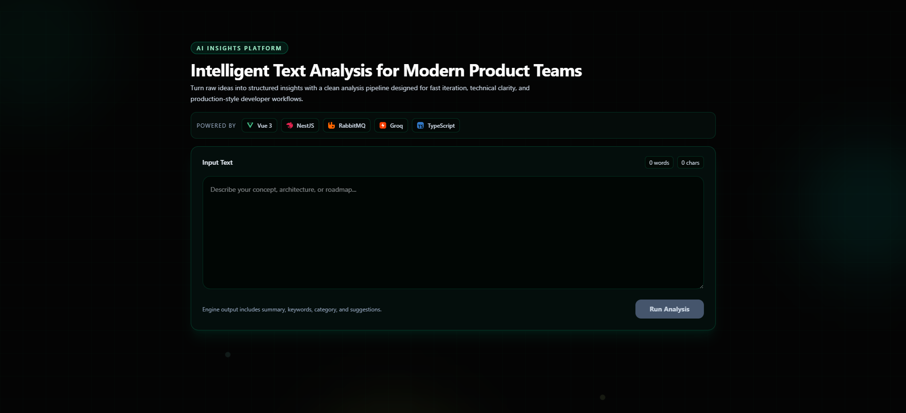

<div align="center">

# AI Insights Platform

*Agentic text analysis — Vue · NestJS · RabbitMQ · Groq*

[](https://vuejs.org/)
[](https://nestjs.com/)
[](https://www.rabbitmq.com/)
[](https://groq.com/)
[](https://www.typescriptlang.org/)

[Preview](#preview) · [Highlights](#what-it-demonstrates) · [Architecture](#architecture) · [Quick start](#quick-start) · [API](#api-summary)

---

</div>

## Preview

<p align="center">
  
</p>

<p align="center">
  <em>Main surface: input, tech stack ribbon, and analysis action.</em>
</p>

### Demo video

<p align="center">
  <a href="https://www.youtube.com/watch?v=eQfiD-oX41c" title="AI Insights Platform — walkthrough">
    
  </a>
</p>

<p align="center">
  <a href="https://www.youtube.com/watch?v=eQfiD-oX41c"><strong>Watch on YouTube</strong></a>
</p>

---

## Overview

End-to-end **agentic text analysis**: a Vue client, a NestJS API, **Groq** for LLM calls, and **RabbitMQ** for asynchronous work. An LLM pass **decides which analysis tasks to run** (with reasoning, input signals, tradeoffs, and skip notes), each task is **published to a queue**, **workers** execute prompts and the store **aggregates** partial results, and the UI **polls** job status. **Developer Insights** exposes per-request telemetry: queue timeline, per-task duration, and decision internals.

---

## What it demonstrates

| Area | Behavior |
|------|----------|
| **Agent-style planning** | Structured JSON: tasks, rationale, signals, tradeoffs, `skip_note` — not only a task array. |
| **Async pipeline** | Tasks hit RabbitMQ (`text_tasks`); workers consume and call Groq per task type. |
| **Job API** | `POST /analyze` returns `jobId`; `GET /analyze/:jobId` until `completed` or `failed`. |
| **Transparency** | Timeline, duration bars, decision prompt, raw model output, aggregation step. |

---

## Architecture

```text
Browser (Vue)  →  POST /analyze  →  NestJS
                         ↓
              LLM: task plan + rationale
                         ↓
              Publish each task → RabbitMQ (text_tasks)
                         ↓
              Worker(s) consume → LLM per task → partial results
                         ↓
              Result store aggregates  →  GET /analyze/:jobId  →  UI
```

---

## Tech stack

| Layer | Choice |
|--------|--------|
| Web app | Vue 3, TypeScript, Vite, Tailwind CSS (package `ai-insights-web`) |
| API | NestJS, TypeScript |
| Queue | RabbitMQ (`amqplib`) |
| LLM | Groq (`groq-sdk`) |
| Local infra | Docker Compose (RabbitMQ + management UI on **15672**) |

---

## Prerequisites

- **Node.js** 20+
- **Docker** (for RabbitMQ)
- **Groq API key**

---

## Quick start

### 1. RabbitMQ

From the repository root:

```bash
docker compose up -d
```

Management UI: `http://localhost:15672` (default `guest` / `guest` unless changed).

### 2. Backend

```bash
cd backend
cp .env.example .env
# Set GROQ_API_KEY (and optionally GROQ_MODEL, RABBITMQ_URL, FRONTEND_ORIGIN)
npm install
npm run start:dev
```

API default: `http://localhost:3000`

### 3. Frontend

```bash
cd frontend
cp .env.example .env
# VITE_API_BASE_URL if not using http://localhost:3000
npm install
npm run dev
```

App default: `http://localhost:5173`

---

## API summary

| Method | Path | Description |
|--------|------|-------------|
| `POST` | `/analyze` | Body: `{ "text": "..." }` → `{ jobId, status }` |
| `GET` | `/analyze/:jobId` | Status, `progress`, optional `result`, optional `insights` |

CORS uses `FRONTEND_ORIGIN`. Full contract: [`backend/README.md`](backend/README.md), [`frontend/README.md`](frontend/README.md).

---

## Repository layout

```text
Agentic/
├── Showcase.png           # UI screenshot (see Preview); walkthrough is on YouTube (below)
├── backend/               # NestJS API, LLM, queue, workers, in-memory job store
├── frontend/              # Vue SPA (npm package: ai-insights-web)
├── docker-compose.yml
├── Devdoc.md              # Design notes / system flow
└── README.md
```

---

## Configuration

| File | Variables |
|------|-----------|
| `backend/.env` | `PORT`, `FRONTEND_ORIGIN`, `RABBITMQ_URL`, `GROQ_API_KEY`, `GROQ_MODEL` |
| `frontend/.env` | `VITE_API_BASE_URL` |

---

## Scripts

| Location | Commands |
|----------|----------|
| `backend/` | `npm run start:dev`, `npm run build` |
| `frontend/` | `npm run dev`, `npm run build` |

---

## License

Add your license here when you publish the repository.
